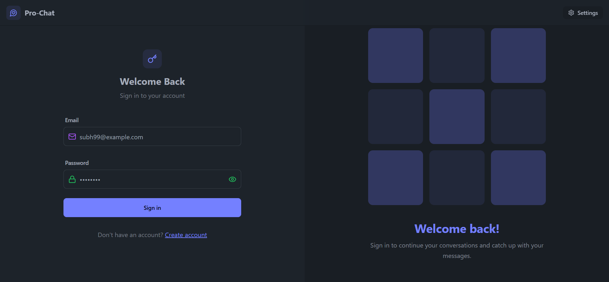
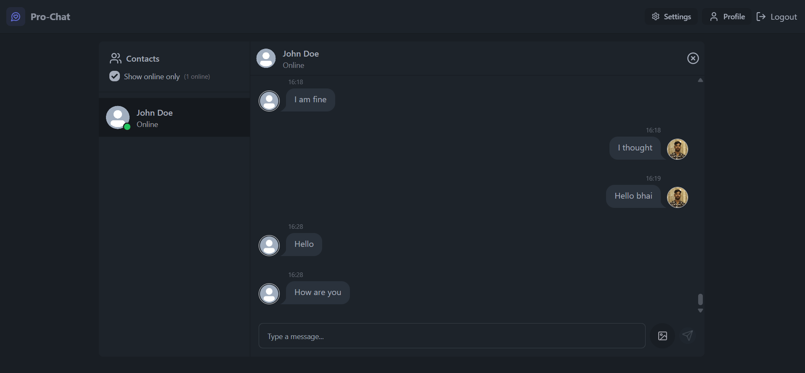
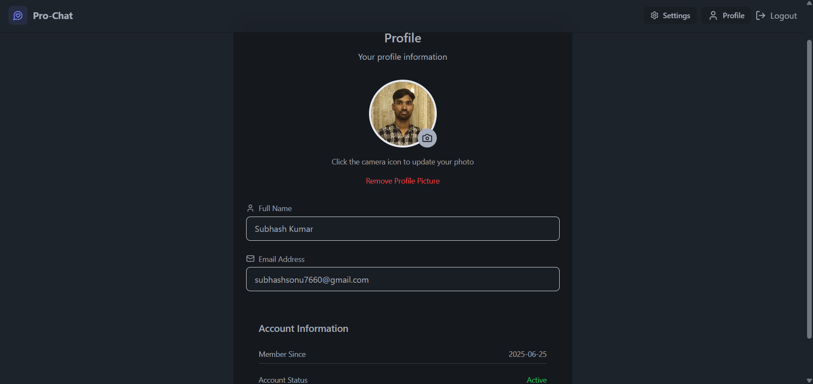
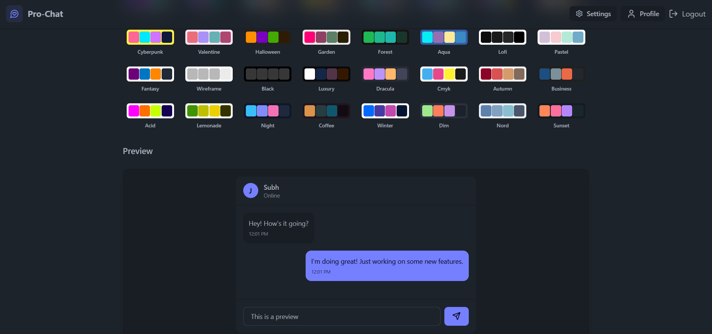

# ✨ ProChat – Real-Time Chat Application ✨

[](https://github.com/SubhashSonu/ProChat/stargazers)
[](https://github.com/SubhashSonu/ProChat/fork)

---

## 🔥 Screenshots

### 🔐 Login Page


### 💬 Chat Interface


### 🙍‍♂️ Profile Page


### 🎨 Theme Settings


---

## 🔗 Live Demo

🌐 [https://prochat-ptyf.onrender.com](https://prochat-ptyf.onrender.com)

---

## 🚀 Features

- ⚡ **Real-time messaging** with Socket.io  
- 🔐 **Authentication & Authorization** using JWT and cookies  
- 🟢 **Online user status** indicators  
- 🖼️ **Image upload support** via Cloudinary  
- 🧠 **Robust error handling** on both client & server sides  
- 🎨 **Clean, modern UI** with TailwindCSS & Daisy UI  
- 🧾 **Global state management** using Zustand  
- 🌍 **Free deployment** on Render  

---

## 🛠️ Tech Stack

- **Frontend**: React, Vite, Zustand, Daisy UI, Tailwind CSS  
- **Backend**: Express.js, Node.js, Socket.io  
- **Database**: MongoDB Atlas  
- **Image Hosting**: Cloudinary  
- **Deployment**: Render  

---

## ⚙️ `.env` Configuration

### For Backend (`/backend/.env`):

```env
MONGODB_URL=your_mongo_connection_string
PORT=5000
JWT_SECRET=your_secret

CLOUDINARY_CLOUD_NAME=your_cloud_name
CLOUDINARY_API_KEY=your_api_key
CLOUDINARY_API_SECRET=your_api_secret

NODE_ENV=development
````

### For Frontend (`/frontend/.env`):

```env
VITE_BACKEND_URL=http://localhost:5000
```

---

## 🧪 Local Development

### 1. Clone the Repository

```bash
git clone https://github.com/SubhashSonu/ProChat
cd ProChat
```

### 2. Install Dependencies

```bash
npm install --prefix backend
npm install --prefix frontend
```

### 3. Start Development Servers

```bash
# Terminal 1
npm run dev --prefix frontend

# Terminal 2
npm start --prefix backend
```

---

## 🧱 Build for Production

```bash
npm run build
```

---

## 🧑‍💻 Author

Made with 💙 by [Subhash Sonu](https://github.com/SubhashSonu)

